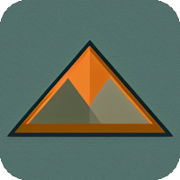

# NR APM (Application Performance and Monitoring) Stack

[NR APM (Application Performance and Monitoring) Stack](https://apm.io.nrs.gov.bc.ca/_plugin/_dashboards) allows teams to tactically respond to potential issues and strategically investigate their KPIs. It is delivered using OpenSearch hosted on AWS. OpenSearch is a open source search and analytics suite derived from Elasticsearch & Kibana.

This documentation is for developers and product owners wanting to integrate their product with the stack.

## More Documentation

OpenSearch documentation is located here:

https://opensearch.org/docs/latest/

Our training, use cases and testimonials are located here:

https://apps.nrs.gov.bc.ca/int/confluence/x/GaRvBQ

