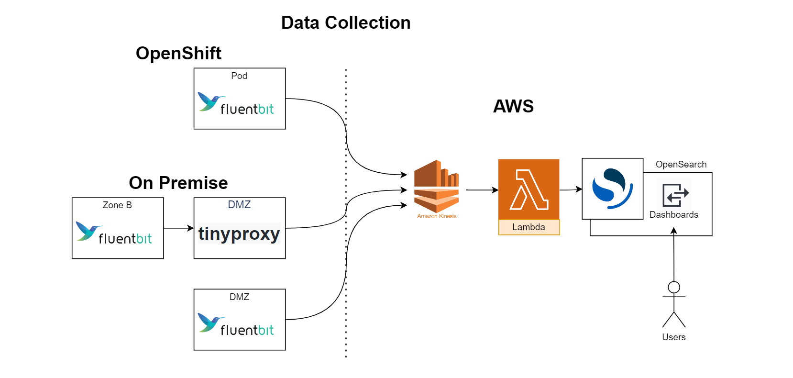
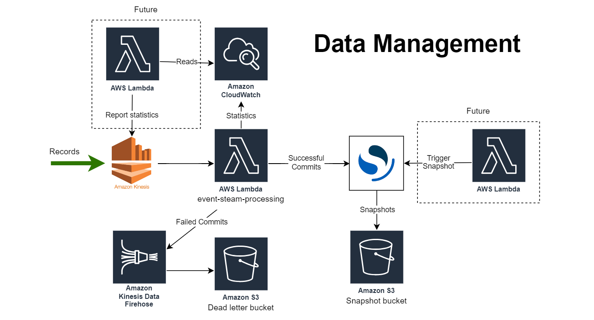

# OpenSearch Architecture

## Environment

OpenSearch Production: [https://apm.io.nrs.gov.bc.ca/_dashboards](https://apm.io.nrs.gov.bc.ca/_dashboards)

## Diagrams




## Log Consumption Architecture


## Deployment
OpenSearch is deployed using Terraform onto the AWS SEA using GitHub Actions. See: [nr-apm-stack](https://github.com/BCDevOps/nr-apm-stack)
```
Terraform is an open-source infrastructure as code software tool that provides a consistent CLI workflow to manage hundreds of cloud services. Terraform codifies cloud APIs into declarative configuration files.
Product website: https://www.terraform.io/
```
