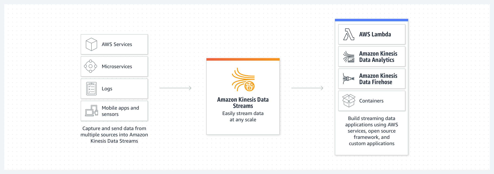
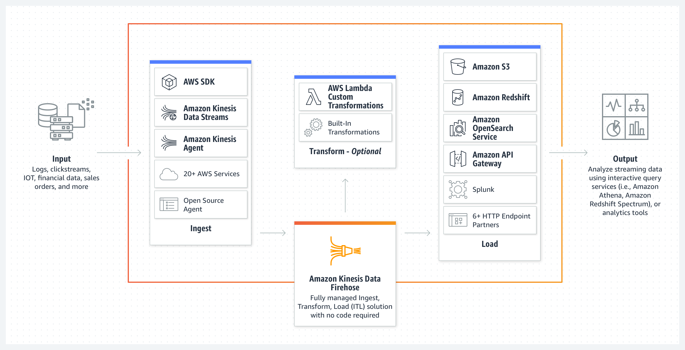

## Amazon Kinesis Data Stream

Amazon Kinesis Data Streams is a serverless streaming data service that makes it easy to capture, process, and store data streams at any scale.

[Amazon kinesis Document](https://aws.amazon.com/kinesis/data-streams/)

## Amazon Kinesis Data Firehose

Amazon Kinesis Data Firehose is an extract, transform, and load (ETL) service that reliably captures, transforms, and delivers streaming data to data lakes, data stores, and analytics services.

[Amazon kinesis Data Firehose Document](https://aws.amazon.com/kinesis/data-firehose/)