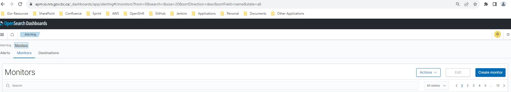
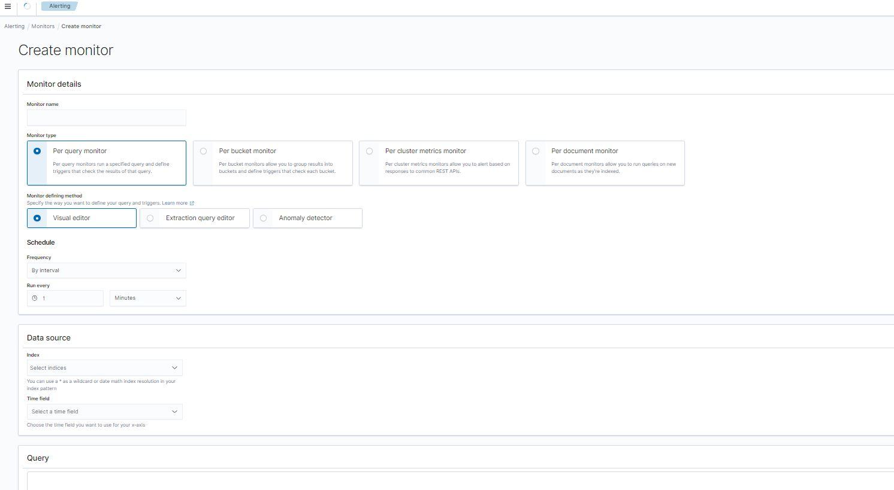
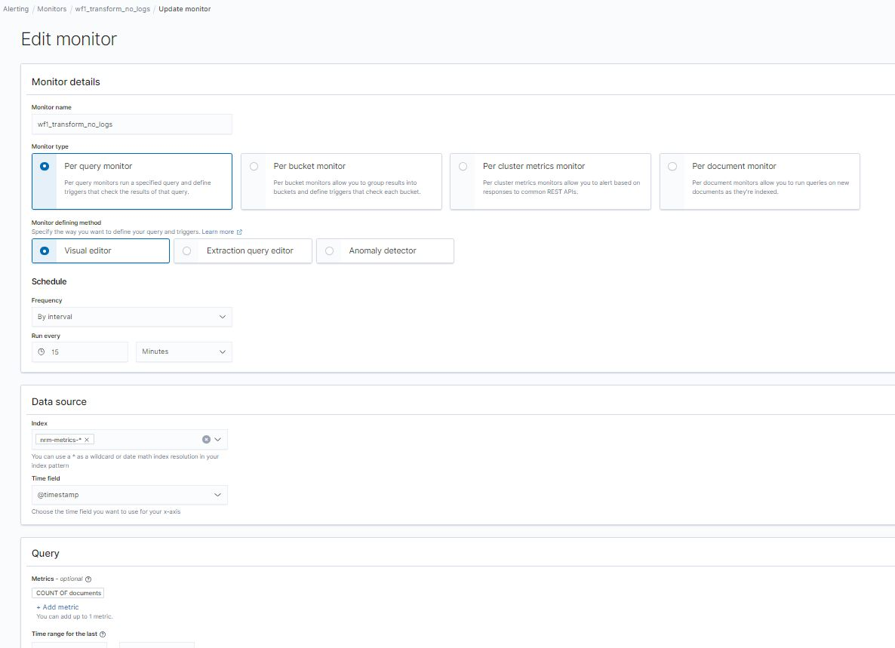
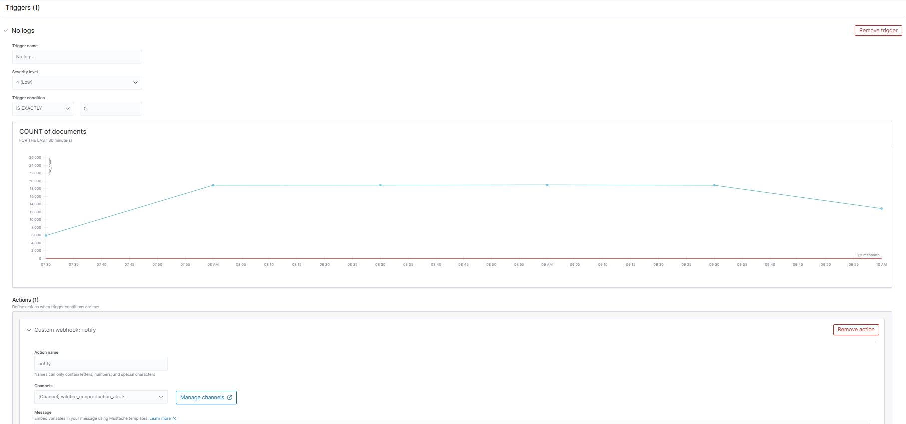
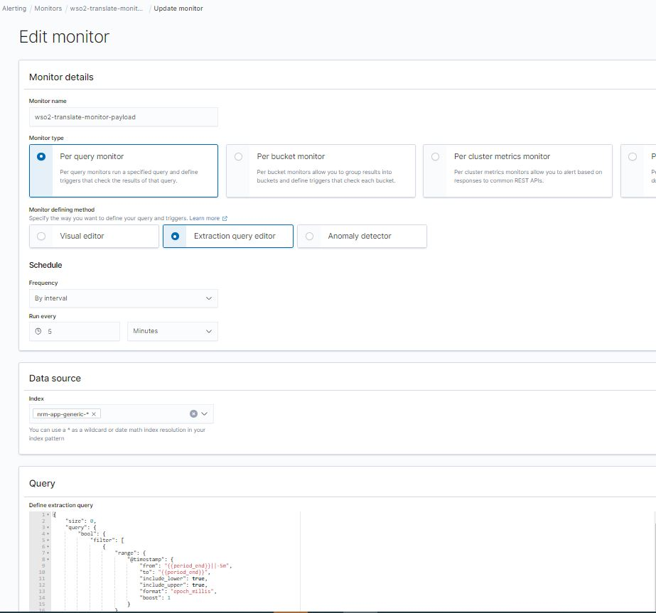
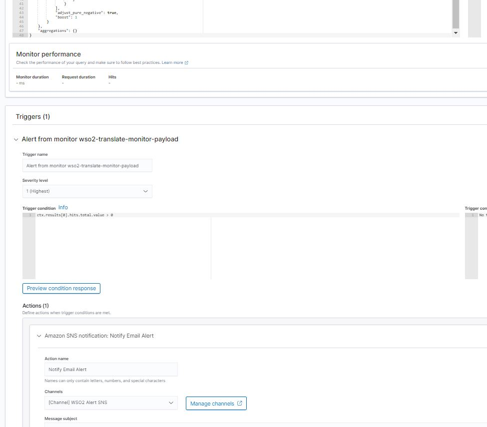

# Create a Monitor for Application/Service

## Add a new AWS SNS Topic if required
- Config SNS Topic File: [topics.json](https://github.com/BCDevOps/nr-apm-stack/blob/main/terraform/topics.json)

| Field Name  | Description                                  | Example                     |
|-------------|----------------------------------------------|-----------------------------|
| display     | display name for SNS topic                   | "display": "WSO2 Alert"     |
| resourceId  | ID for SNS topic                             | "resourceId": "wso2-alert" |
| sqsEndpoint | destination for SQS is true others are false | "sqsEndpoint": false        |

After deployment the new SNS topic should be displayed in OpenSearch->Notification->Channels

## Create a Monitor for Fluent Bit Agent Status with Terraform
- Ensure target server/# of Fluent Bit Agents is correct in [fluentbit_agent.csv](https://github.com/bcgov-nr/nr-funbucks/blob/main/scripts/fluentbit_agents.csv)

- Command to generate file monitors.json from [nr-funbucks](https://github.com/bcgov-nr/nr-funbucks): ./bin/dev monitors

- Copy monitors.json to [nr-apm-stack](https://github.com/BCDevOps/nr-apm-stack) under terraform

- PR for [nr-apm-stack](https://github.com/BCDevOps/nr-apm-stack) for OneTeam to review and deploy to AWS

## Create a Monitor for Application/Service with Terraform

- Configuration File for application alerts: [app-alert.yaml](https://github.com/BCDevOps/nr-apm-stack/blob/main/terraform/app-alert.yaml)

- Add/Modify entries for monitors in the file with query and fields listed below

| Field Name                 | Description                                                               | Example                                                                  |
|----------------------------|---------------------------------------------------------------------------|--------------------------------------------------------------------------|
| name                       | monitor name (unique) (appname-servername-type-keywords)                  | wso2-translate-monitor-payload                                           |
| index                      | openSearch index name                                                     | nrm-app-generic-* nrm-access-* nrm-metrics-*                             |
| query_level_trigger_id     | trigger id                                                                | length: 20 random 20 digits and chars (lowercase)                        |
| automation_queue_action_id | monitor queue action id                                                   | length: 20 random 20 digits and chars (lowercase)                        |
| interval                   | interval for monitor                                                      | unit is minute interval: 5  - monitor every 5 minutes                    |
| severity                   | severity of monitor                                                       | severity: '1'                                                            |
| queue_name                 | webhook or sns topic name                                                 | queue_name: wso2-alert wso2-alert is SNS topic name                      |
| throttle                   | limit the number of notifications you receive within a given span of time | unit is minute throttle: 60                                              |
| trigger_source             | Script to trigger the notification actions                                | ctx.results[0].hits.total.value > 0 ctx.results[0].hits.total.value == 0 |
| queryblock                 | OpenSearch DSL query block                                                | https://opensearch.org/docs/1.0/opensearch/query-dsl/full-text           |

After deployment, monitors will be updated and displayed in OpenSearch monitors list

## Create a Monitor with OpenSearch UI - Manual Steps

- Login OpenSearch
- Main Menu -> Alerting -> Monitors -> **Create monitor**

<em>Currently, we only use two defined method to create a monitor: **Visual Editor** and **Extraction query editor**</em>

**Example for Setup a Monitor with Visual Editor:**

**Example for Setup a Monitor with Extraction Query Editor:**

- Trigger: Setup Trigger name and Trigger condition

<em>Example showed on above images</em>

- Action: Setup Action name, channel, and message

<em>Example showed on above images</em>
